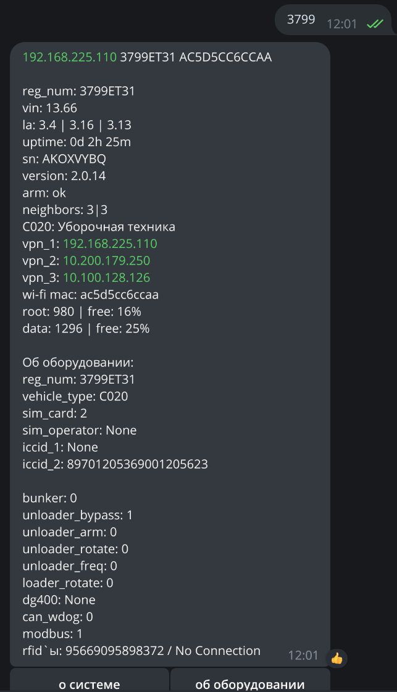
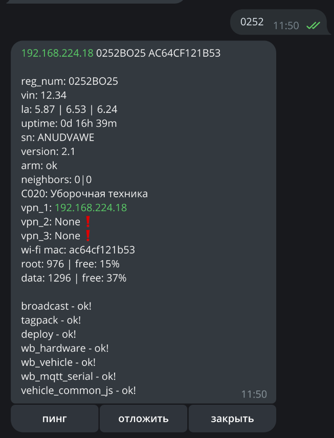
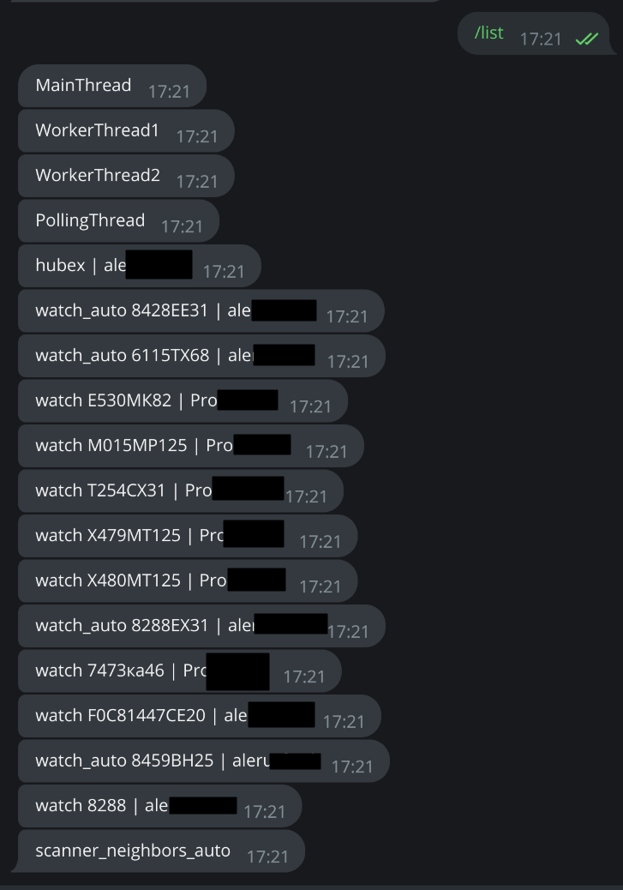

<h1>Телеграм Бот АСУТП</h1>
<h3>без VPN и конфига (работать не будет)</h3> 
<h6>• в основе используется nmap сканер сети (файл neighbors.py)</h6>
<h6>• опрос основных параметров контроллера через mqtt протокол (paho)</h6>
<h6>• проверка, исправление служб\конфигов через ssh и sftp - протоколы (paramiko)</h6>
<h6>• полная интеграция со всеми имеющимися гугл таблицами и справочниками</h6>
<h6>• выгрузка, отслеживание, автообработка тикетов с ServiceDesk Hubex.ru</h6>
<h6>• автоматическая проверка, и исправление 6 основных конфигов в два клика</h6>
<h6>• создание сертификатов OpenVPN, регистрация и настройка контроллера</h6>
<h6>• отслеживание техники по регистрационному номеру, идентификатору контроллера</h6>
<h6>• автосбор собственной БД</h6>
<h6>• многопользовательский режим</h6> 
<h6>• </h6>

 
 
 
 
 
 
 
 
 
 
 
 
 
 
 
 

